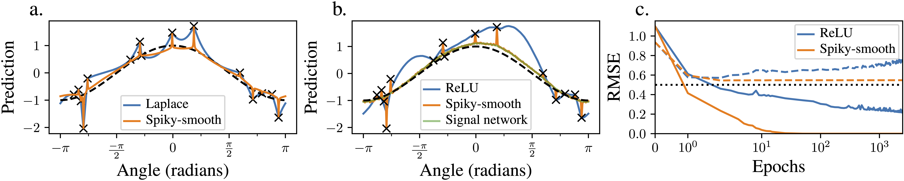

# Mind the Spikes: Benign overfitting of kernels and neural networks in fixed dimension

<p align="center">
  
</p>

This repository accompanies the preprint ['Mind the Spikes: Benign overfitting of kernels and neural networks in fixed dimension'](https://arxiv.org/pdf/2305.14077.pdf).

The experiments investigate how to adapt neural network activation functions to enable benign overfitting in arbitrary dimension. For this purpose we investigate a sequence of kernels we call 'spiky-smooth kernels' and compute the corresponding activation functions, when writing this kernel sequence as an NTK or a neural network Gaussian process kernel. Remarkably, using Gaussian kernels as spike component approximately translates into adding a small high-frequency oszillation to the activation function. Our experiments indeed show that trained neural networks do not exhibit benign overfitting with the ReLU activation function but that this can be fixed by adding small high-frequency oscillations to the activation function. Using the parameters learned with the spiky-smooth activation function in a ReLU network removes the spikes that are useful for overfitting and yields the learned 'signal component' that overfits less and is more adversarially robust.

Do not hesitate to reach out, if you have questions or comments.

## Installation

All experiments are implemented in Python 3.9.5.

The code works with the following packages:

- matplotlib==3.3.4

- mpmath==1.3.0

- numpy==1.20.3

- scipy==1.8.0

- seaborn==0.11.1

- torch==1.12.1

- tueplots==0.0.3

In the python scripts, adjust the paths where summary statistics are saved to your preferences. Make sure the folder structure exists before running the code.

## Overview

Precomputed files are provided in `outputs/`. All of these files can be recomputed with the provided Python scripts.

### Figure 1: Training spiky-smooth kernels and neural networks with spiky-smooth activation functions as well as disentangling the learned signal from the spikes

Run `train_spikysmooth_nns.py`

### Figure 2: Visualizing a spiky-smooth kernel

Run `kernelplot.py`

### Figure 3: Calculating and visualizing spiky-smooth activation functions and their Hermite coefficients up to high orders

First run `activation_functions_spikysmooth.py`

The script precomputes the function values and Hermite series coefficients of the spiky-smooth activation functions induced by the spiky-smooth kernel with Gaussian components. Run the script for all hyperparameters of interest. This can be easily done by varying the `irun` value between 0 and 11.

Once all activation function coefficients and values of interest are precomputed, generate Figure 3 by running `figure3.py`

### Appendix Figures

For disentangling signal from noise with kernels or in neural networks with spiky-smooth activation functions: `train_spikysmooth_nns.py`

For repeating the finite-sample experiments of Figure 1: `train_spikysmooth_nns.py`

For plotting spiky-smooth or isolated spike activation functions:` plot_activations.py`

For evaluating the approximation quality of the additive decomposition or the sin-fits Eq. (7) and Eq. (8): `sinfit.py`

For evaluating spiky-smooth kernels on finite datasets with various hyperparameter choices: `kernel_regression_spikysmooth.py`

## Citation

If you use this software please cite the following publication:

```bib
@misc{mindthespikes,
      title={Mind the spikes: Benign overfitting of kernels and neural networks in fixed dimension}, 
      author={Moritz Haas and David Holzmüller and Ulrike von Luxburg and Ingo Steinwart},
      year={2023},
      eprint={2305.14077},
      archivePrefix={arXiv},
      primaryClass={stat.ML}
}
```
